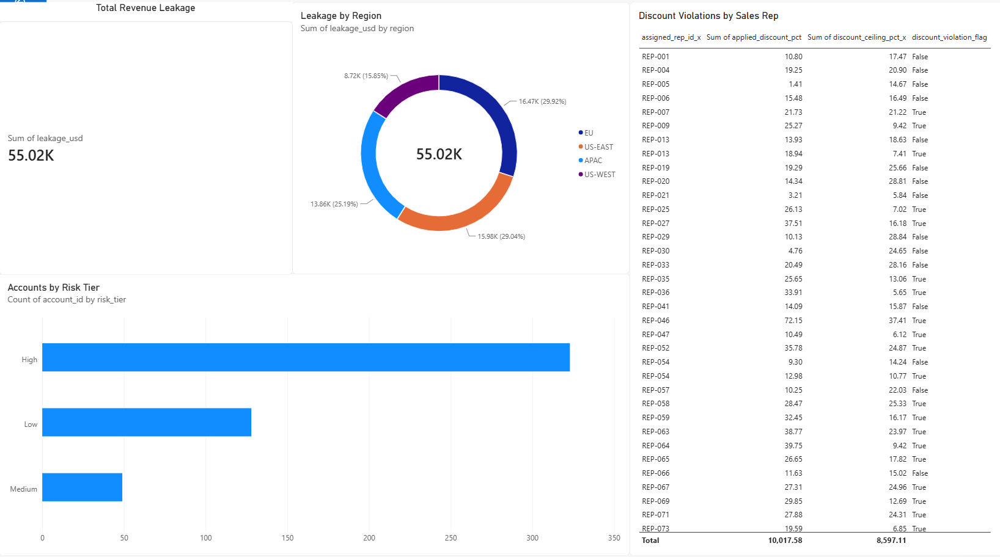

# Oracle Cloud Revenue Leakage Detection Pipeline

An end-to-end data engineering pipeline that automatically detects revenue leakage in Oracle cloud contracts using AWS, Python, and Machine Learning.

## Business Problem
Oracle's revenue operations team loses millions annually due to three types of leakage:
- **Overuse** — customers consuming more cloud resources than their contract allows
- **Underbilling** — invoices sent below actual usage cost
- **Discount violations** — sales reps applying discounts beyond their authorized ceiling

## Solution
An automated pipeline that joins usage, contract, and billing data daily, flags leakage automatically, scores account risk using ML models, and delivers insights via a Power BI dashboard.

## Results
- **$92,420 in revenue leakage detected** across 500 accounts
- **334 accounts flagged** with at least one leakage type
- **97% precision, 99% recall** on leakage detection model
- **295 discount violations** identified across sales reps

## Architecture
EventBridge (daily cron)
→ AWS Step Functions (orchestrator)
→ Lambda 1: generates and ingests data to S3
→ Lambda 2: cleans, joins, scores leakage
→ S3 (Hive-partitioned data lake)
→ Power BI dashboard


## Tech Stack
| Layer | Technology |
|-------|-----------|
| Ingestion | AWS Lambda, Python |
| Storage | AWS S3 (Hive partitioning) |
| Orchestration | AWS Step Functions, EventBridge |
| Infrastructure | Terraform (IaC) |
| Processing | Python, pandas |
| ML Models | Isolation Forest, Logistic Regression |
| Testing | PyTest (5 unit tests) |
| Visualization | Power BI |

## Project Structure
oracle-revenue-pipeline/
├── generate_data.py # Synthetic data generation
├── generate_contracts.py # Contract data generator
├── test_pipeline.py # PyTest unit tests
├── terraform/
│ └── main.tf # Infrastructure as Code
└── README.md


## ML Models
**Isolation Forest** (unsupervised) — detects anomalous accounts without labeled data

**Logistic Regression** (supervised) — scores each account with a leakage risk percentage and assigns a risk tier (High/Medium/Low)

## S3 Data Lake Structure
s3://oracle-revenue-pipeline/
├── raw/
│ ├── contracts/year=2026/month=09/day=19/
│ ├── usage/year=2026/month=09/day=19/
│ └── billing/year=2026/month=09/day=19/
└── processed/
└── year=2026/month=09/day=19/leakage_report.csv


## Infrastructure as Code
All AWS resources are provisioned via Terraform:
- S3 bucket with partitioned folder structure
- 2 Lambda functions (generator + processor)
- IAM roles and policies
- Step Functions state machine
- EventBridge daily schedule

To deploy:
```bash
cd terraform
terraform init
terraform apply
```

## Key Findings
- EU and US-EAST regions account for ~59% of total leakage
- 323 out of 500 accounts scored as High risk
- REP-088 and REP-046 had the highest discount violations
## Infrastructure as Code
All AWS resources are provisioned via Terraform:
- S3 bucket with partitioned folder structure
- 2 Lambda functions (generator + processor)
- IAM roles and policies
- Step Functions state machine
- EventBridge daily schedule

To deploy:
```bash
cd terraform
terraform init
terraform apply
```

## Key Findings
- EU and US-EAST regions account for ~59% of total leakage
- 323 out of 500 accounts scored as High risk
- REP-088 and REP-046 had the highest discount violations

## Dashboard Insights

The Power BI dashboard provides four key views for Oracle's Revenue Operations team:

**1. Total Revenue Leakage (KPI Card)**
Shows $55K in overuse leakage detected across all accounts. This is the headline number a revenue operations manager sees first thing every morning.

**2. Accounts by Risk Tier (Bar Chart)**
- 323 accounts scored as **High risk** — immediate action required
- 128 accounts scored as **Low risk** — monitor only
- 49 accounts scored as **Medium risk** — review recommended

This chart helps the team prioritize which accounts to investigate first rather than manually reviewing all 500.

**3. Leakage by Region (Donut Chart)**
- EU: $16.47K (29.9%) — highest leakage region
- US-EAST: $15.98K (29%) — second highest
- APAC: $13.86K (25.2%)
- US-WEST: $8.72K (15.8%)

This tells regional sales managers exactly where to focus their billing correction efforts.

**4. Discount Violations by Sales Rep (Table)**
Lists every sales rep who applied a discount beyond their authorized ceiling. For example:
- REP-088 applied 72.92% discount against a 30.07% ceiling
- REP-046 applied 72.15% discount against a 37.41% ceiling

This table enables sales leadership to take corrective action with specific reps and recover lost margin.

## Dashboard
